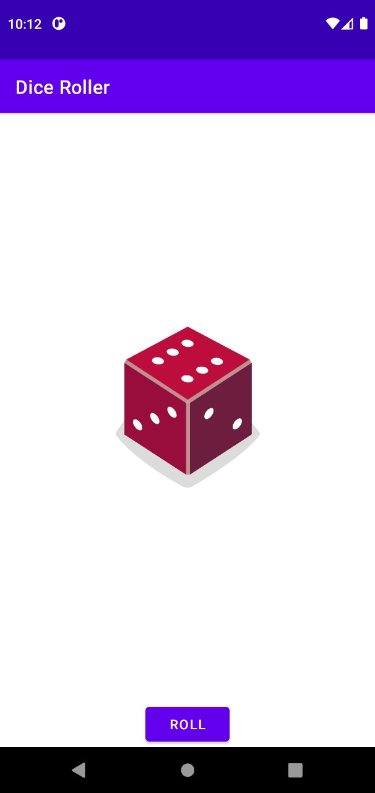
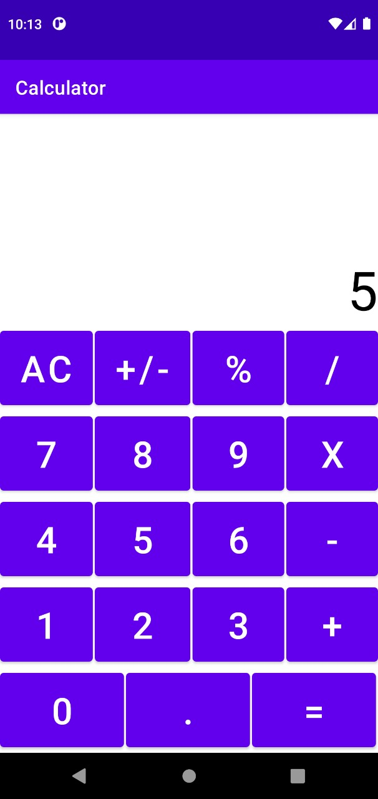

# **Project Description**

---

These are applications built for **Android Study Jams 2022 at Chitkara University**

Note that directly copying the code may not work due to different package names. This is just for the reference of students.

# Goals

> Targets to achieve

---

- Making your First 2 Applications in 3 days
- Attain Basic Knowledge of Kotlin
- Learn Basics of Android Studio

# Specifications

> What each file does

---

- XML Files contain the Views of the application
- .kt files contain the logic

# Design

> How it Looks

---

<!-- Blockquote -->

---

<!-- Images -->

<!-- Github Markdown -->

---

---

[Armaan Jain](https://www.instagram.com/_armaanjain/?hl=en "Armaan Jain")
